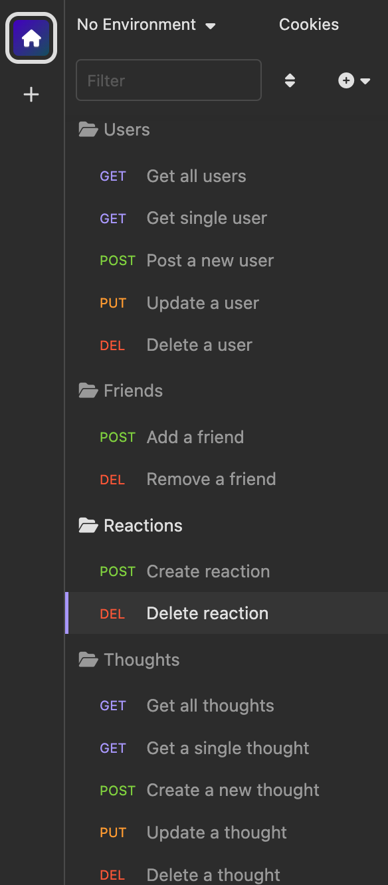

# Social Network API

## Description
  This is an API for a social network web application where users can share their thoughts, react to friends’ thoughts, and create a friend list. This uses Express.js for routing, a MongoDb database, and the Mongoose ODM.

## Table of Contents
  - [Installation](#installation)
  - [Usage](#usage)
  - [Features](#features)
  - [License](#license)

  ## Installation
  Clone the respository from the repo in GitHub to your local machine. Make sure you install Node.js and NPM on your computer. Run `npm install` to install dependencies and `npm run start` to start the application.

  ## Usage
  You can find the walkthrough video here - [social network api walkthrough video](https://drive.google.com/file/d/1g4vKQXPYE9b0YYgCfHOxla7UCswXcBQW/view?usp=sharing)

  

  

  

 
 
  

## Features
* Node.js
* Express.js
* Mongoose
* MongoDB

## License
The project is licensed under MIT. For more information, please refer to the LICENSE in the repo.
  